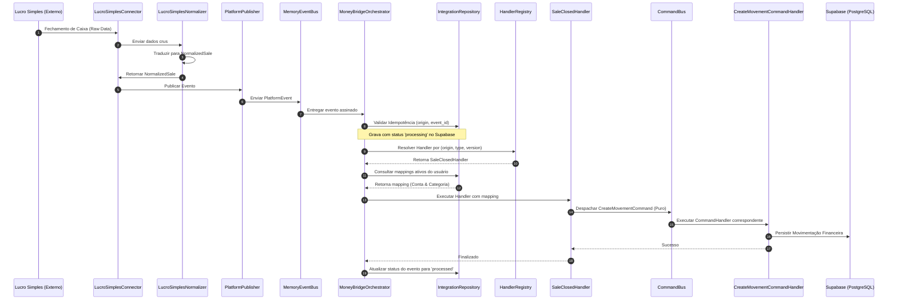

# JA Platform — MoneyBridge Data Flow

O diagrama a seguir descreve a jornada visual completa do processamento de eventos do MoneyBridge, desde o recebimento de dados do sistema externo até a persistência no banco de dados do FinanceOS.

